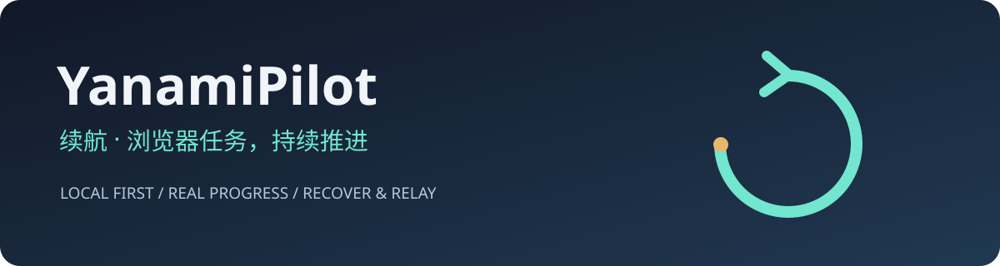

# YanamiPilot · 续航



**Keep browser tasks moving. Make interruptions visible.**

[中文](README.md)

A local Python / Playwright runner extracted from real course-playback troubleshooting. Version 0.1.0 includes one Zhihuishu video adapter, bounded recovery, actual playback-rate checks, a persistent browser profile, state files, and an offline two-video demo.

```bash
uv sync --locked
uv run playwright install chromium
uv run yanamipilot demo
```

The demo runs entirely on loopback with original generated media. To configure a real session, copy `examples/config.toml` to `config.toml`, enter your course URL and actual catalog count, then run `uv run yanamipilot run`. Sign in in the separate browser window. Use `yanamipilot status` and `yanamipilot stop` for local control.

Routine operations require no cloud model or API key. The optional `ocr` extra provides experimental local color/uppercase-character recognition. Each attempt requires fresh, challenge-bound approval; uncertain results and sliders require manual intervention. Real-platform automatic CAPTCHA acceptance is **not validated**. This is not a general website automation engine and does not include remote notifications or agent wake-up integration.

Test: `uv run python -m unittest discover -s tests -v`. Build: `uv build`.

Use only where automation is permitted. Keep all profiles, login state, screenshots, and runtime data private. See [validation](docs/VALIDATION.md), [roadmap](docs/ROADMAP.md), [contributing](CONTRIBUTING.md), and [third-party notices](THIRD_PARTY_NOTICES.md).

MIT. Developed from a standalone browser runner during work involving [university-helper](https://github.com/sweetcornna/university-helper); the upstream backend is not bundled or required. No affiliation with OpenAI or course platforms.
